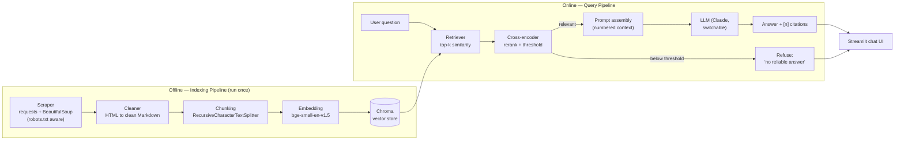

<!-- The YAML block above is Hugging Face Spaces metadata (GitHub hides it). -->

# 🎓 UK Student Visa & Study-Life Assistant — a RAG Q&A System

A Retrieval-Augmented Generation (RAG) question-answering assistant that helps
international students in the UK with **Student/Graduate visa rules, the right to
work, opening a bank account, and registering with the NHS/GP** — grounded in
official sources (gov.uk, UKCISA, NHS) with **inline source citations** and a
built-in **anti-hallucination guard** that refuses to answer when it isn't sure.

> Portfolio project demonstrating end-to-end Data Science / AI engineering:
> data ingestion → chunking → embeddings → vector search → reranking → grounded
> generation → evaluation → deployment.

---

**🔗 Live demo:** _add your Hugging Face Space URL here after deploying_

**📊 Results** (held-out eval — see [Evaluation](#-evaluation)): Retrieval
Hit-Rate@4 **100%** · MRR **0.78** · Answer correctness **100%** · Refusal
accuracy **100%** (15 cases).

---

## ✨ Key Features

- **Grounded answers with citations** — every claim points back to the source document/chunk.
- **Anti-hallucination guard** — cross-encoder reranking + a relevance threshold; if nothing relevant is found, it says so instead of making things up.
- **Open-source, low-cost stack** — local embeddings (`bge-small-en-v1.5`) + Chroma; only the LLM calls cost money.
- **Switchable LLM** — Claude by default, behind an abstraction so you can swap providers via one env var.
- **Reproducible pipeline** — scripts to scrape → build index → evaluate.
- **Evaluated** — a held-out question set measures retrieval hit-rate and answer relevance (see [Evaluation](#-evaluation)).

---

## 🏗️ Architecture



**Flow:** scrape → clean → chunk → embed → store in Chroma (offline, once). At
query time: retrieve top-k → rerank with a cross-encoder → if the best score
clears the threshold, generate a cited answer with the LLM; otherwise refuse.

---

## 🧰 Tech Stack & Rationale

| Layer | Choice | Why |
|---|---|---|
| Orchestration | **LangChain** | Industry-standard (resume signal), clean LLM abstraction for provider-switching, first-class Chroma/HF integrations. |
| Vector store | **Chroma** (local, persistent) | Free, zero-ops, bundles into Hugging Face Spaces. |
| Embeddings | **`BAAI/bge-small-en-v1.5`** | Strong English retrieval, ~130 MB, runs on free CPU; top of its size class on MTEB. |
| Reranker | **`cross-encoder/ms-marco-MiniLM-L-6-v2`** | Cheap, accurate relevance scoring; powers the hallucination guard. |
| LLM | **Claude Sonnet 4.6** (default, switchable) | High answer quality and citation fidelity; behind an interface for easy swapping. |
| UI | **Streamlit** | Native chat components, quick to build, free hosting. |
| Deployment | **Hugging Face Spaces** | Free, git-based, supports Streamlit + secrets. |

---

## 📁 Project Structure

```
uk-student-visa-rag/
├── data/
│   ├── raw/                 # scraped HTML (git-ignored, reproducible)
│   └── processed/           # cleaned Markdown docs = the knowledge base
├── src/
│   ├── config.py            # single source of truth for all settings
│   ├── prompts.py           # system/user prompts (citation + refusal contract)
│   ├── ingestion/           # scraper.py, cleaner.py
│   ├── chunking/            # splitter.py
│   ├── indexing/            # embedder.py, vector_store.py
│   ├── retrieval/           # retriever.py (similarity + rerank + guard)
│   └── generation/          # llm.py (provider abstraction), rag_pipeline.py
├── app/streamlit_app.py     # chat UI
├── scripts/                 # 1_scrape.py, 2_build_index.py
├── eval/                    # test_set.json, evaluate.py
├── tests/                   # unit tests
├── requirements.txt
├── .env.example
└── README.md
```

---

## 🚀 Getting Started

### 1. Set up the environment
```bash
python3.13 -m venv .venv
source .venv/bin/activate
pip install -r requirements.txt
```

### 2. Configure secrets
```bash
cp .env.example .env
# edit .env and set ANTHROPIC_API_KEY=...
```

### 3. Build the knowledge base
```bash
python scripts/1_scrape.py        # fetch & clean official sources -> data/processed/
python scripts/2_build_index.py   # chunk, embed, persist to Chroma
```

### 4. Run the app
```bash
streamlit run app/streamlit_app.py
```

### 5. Run tests & evaluation
```bash
pytest                 # unit tests
python eval/evaluate.py   # retrieval & answer-relevance metrics
```

---

## 🧪 Evaluation

We evaluate on a held-out set of **12 in-scope + 3 out-of-scope** questions with
reference key-facts (`eval/test_set.json`). Reproduce with `python eval/evaluate.py`.

| Metric | Score |
|---|---|
| Retrieval Hit-Rate @4 | **100%** (12/12) |
| Mean Reciprocal Rank (MRR) | **0.78** |
| Answer correctness (key-fact coverage) | **100%** (12/12) |
| Refusal accuracy (out-of-scope) | **100%** (3/3) |

> This is a small, curated set — it measures the pipeline on representative
> questions, not a large public benchmark. MRR of 0.78 reflects the expected
> source usually ranking 1st–2nd after cross-encoder reranking (not always 1st),
> which is why Hit-Rate@4 is higher than MRR.

---

## 🛡️ Anti-Hallucination Design

1. **Reranking + threshold** — candidates are re-scored by a cross-encoder; if the best score is below `min_relevance_score`, the system refuses rather than guessing.
2. **Strict prompt contract** — the model is instructed to answer *only* from the provided context and to use an exact refusal sentence when context is insufficient.
3. **Mandatory citations** — every claim must reference a numbered context chunk, making answers auditable.

---

## ☁️ Deployment (GitHub + Hugging Face Spaces)

The repo is **deploy-ready**: on first launch the app builds the vector index
from the committed `data/processed/` corpus, so no scraping runs on the server.

**1 — Push the code to GitHub**
```bash
git init && git add . && git commit -m "Initial commit"
git branch -M main
git remote add origin https://github.com/<you>/<repo>.git
git push -u origin main
```

**2 — Deploy the live demo on Hugging Face Spaces**
1. Create a new **Streamlit** Space at https://huggingface.co/new-space
2. In the Space: **Settings → Variables and secrets** → add a secret
   `ANTHROPIC_API_KEY` with your key.
3. Push this repo to the Space's git remote:
   ```bash
   git remote add space https://huggingface.co/spaces/<you>/<space-name>
   git push space main
   ```
4. The Space installs `requirements.txt`, runs `app/streamlit_app.py`, and builds
   the index on first launch (~1 min). SDK / app file / Python version come from
   the YAML front-matter at the top of this README.

---

## 📸 Screenshots

_Run `streamlit run app/streamlit_app.py`, then add images to `docs/` and embed
them here — e.g._ ``.

Suggested shots: (1) a cited answer with the **Sources** panel expanded, and
(2) an out-of-scope question showing the **refusal** behaviour.

---

## 📚 Data Sources & Licensing

- **gov.uk** — Student visa, Graduate visa, right to work (Crown copyright, Open Government Licence v3.0).
- **UKCISA** — international student guidance.
- **NHS** — registering with a GP as an overseas student.

Content is fetched respectfully (robots.txt checked, rate-limited) and stored
only for this educational demo.

> ⚠️ **Disclaimer:** This is a portfolio/educational project and **not official
> immigration advice**. Always verify with the official sources above or your
> university's international student office.

---

## 🗺️ Project Status

- [x] **P0** Scaffold (structure, config, requirements)
- [x] **P1** Data ingestion (scrape + clean) — 19 official docs, ~28k words
- [x] **P2** Index build (chunk + embed + Chroma) — 293 chunks, cosine space
- [x] **P3** Retrieval + rerank + guard — bge recall → cross-encoder → threshold
- [x] **P4** Generation (Claude + citations) — two-layer hallucination guard verified
- [x] **P5** Streamlit UI — chat, source panel, refusal styling
- [x] **P6** Unit tests — 20 tests (chunking, cleaning, retrieval, pipeline guards)
- [x] **P7** Evaluation — Hit-Rate@4 100%, MRR 0.78, refusal 100% (12+3 cases)
- [x] **P8** Docs polish + deployment-ready (HF Spaces config, self-bootstrapping index)
